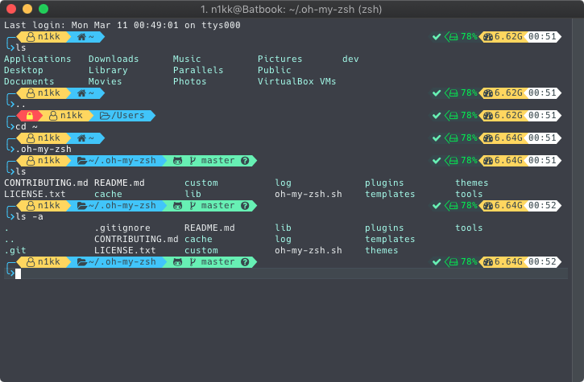
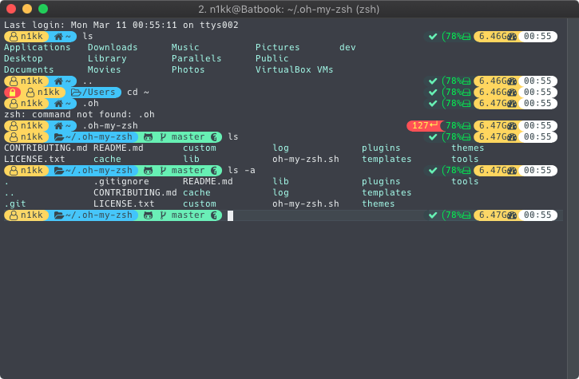

This is my [Powerlevel9k](https://github.com/bhilburn/powerlevel9k) config.



I had to implement some extra functionality to achieve this but now my PR is merged and you can just get the `next` `branch of [powerlevel9k repo](https://github.com/bhilburn/powerlevel9k/tree/next) to get this working.

If you have the repo already:
```bash
git fetch origin
git checkout next
```

Full [iTerm2](https://www.iterm2.com/) config is in `com.googlecode.iterm2.plist`

- Font: 11pt `Hack Regular Nerd Font Complete`
- Non ACSII font: 12pt `Literation Mono Nerd Font Complete`
```bash
# setup brew fonts
brew tap caskroom/fonts
# install nerd fonts
brew cask install font-hack-nerd-font font-liberationmono-nerd-font
```

Color palette: modified [Material Design](https://github.com/MartinSeeler/iterm2-material-design) in `colors/modified-material.itermcolors`

Other style:


